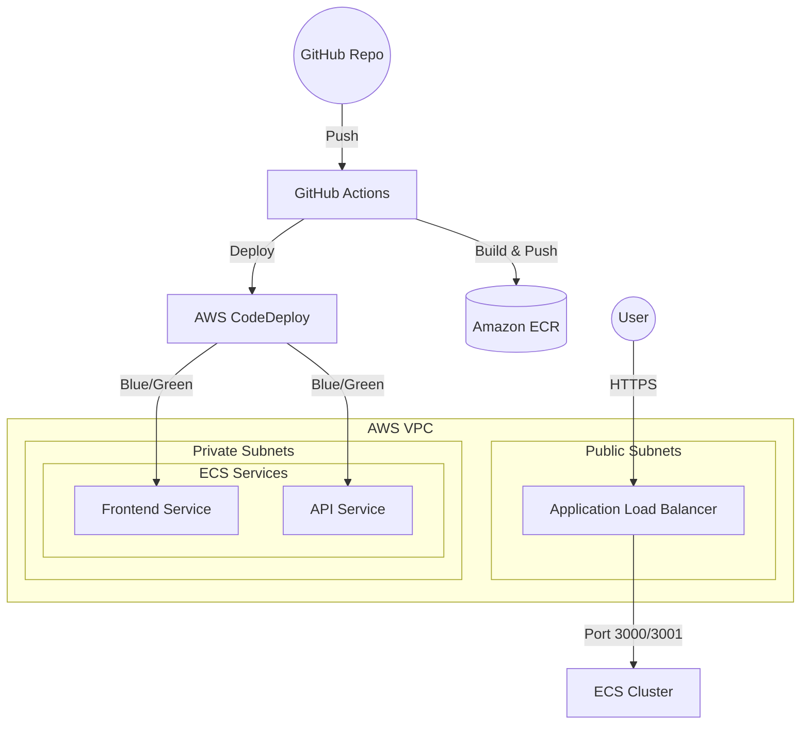

# AWS ECS Infrastructure with Terraform

This project provides a robust, modular, and scalable Terraform configuration to deploy containerized applications on AWS ECS. It supports both **EC2** and **Fargate** launch types, integrated with Application Load Balancer (ALB), Blue/Green deployments, and Service Connect.

## 🚀 Features

- **Multi-Service Architecture**: Easily manage multiple services within a single ECS cluster.
- **Flexible Infrastructure**: Switch between EC2 and Fargate by changing a single variable.
- **Advanced Networking**: Automated VPC, public/private subnets, and security group management.
- **Blue/Green Deployments**: Built-in support for ECS native Blue/Green deployment strategy.
- **Service Connect**: Internal service-to-service communication using Service Connect.
- **Autoscaling**: Target tracking scaling based on CPU or memory metrics.
- **Security First**: Granular IAM roles and least-privileged security groups.

## 🗺️ Architecture Overview



## 📁 Project Structure

```text
├── main.tf              # Provider and backend configuration
├── variables.tf         # Global input variables
├── modules.tf           # Module orchestrator
├── outputs.tf           # Project outputs
├── demo.tfvars          # Example configuration file
├── modules/
│   ├── networking/      # VPC, Subnets, IGW, NAT, Security Groups
│   ├── loadbalancing/   # ALB, Target Groups, Listeners, Rules
│   └── ecs/              # Cluster, Services, Tasks, IAM, Capacity Providers
└── docs/                # Additional documentation
```

## 🛠 Prerequisites

- [Terraform](https://www.terraform.io/downloads.html) (v1.5+)
- [AWS CLI](https://aws.amazon.com/cli/) configured with appropriate credentials
- Docker (for building/pushing images to ECR)

## 🚦 Quick Start

1. **Initialize Terraform:**
   ```bash
   terraform init
   ```

2. **Review Plan:**
   ```bash
   terraform plan -var-file="demo.tfvars"
   ```

3. **Deploy:**
   ```bash
   terraform apply -var-file="demo.tfvars"
   ```

## ⚙️ Configuration

### General Project Settings
| Variable | Description | Default |
|----------|-------------|---------|
| `general.environment` | Deployment environment (e.g., `dev`, `prod`) | Required |
| `general.project` | Project name used for naming resources | Required |
| `general.region` | AWS Region | Required |

### Infrastructure Settings
| Variable | Description | Default |
|----------|-------------|---------|
| `infrastructure.type` | Launch type: `EC2` or `FARGATE` | `EC2` |
| `infrastructure.ec2_types` | List of allowed instance types (for EC2) | `[]` |

### Service Settings
Each service in the `services` map supports:
- `img`: Docker image URI
- `desired_count`: Number of tasks to run
- `alb_path`: URL path for routing (e.g., `/*`, `/api/*`)
- `deploy.strategy`: Deployment strategy (`ECS` or `BLUE_GREEN`)
- `autoscaling.enabled`: Enable/disable autoscaling

## 📝 Documentation
- [Example Configurations](./docs/examples.md)
- [Deployment Recommendations](./docs/recommendations.md)
- [Known Issues & Bugs](./docs/bugs.md)
